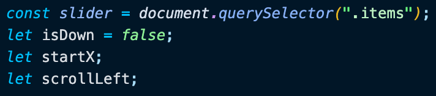
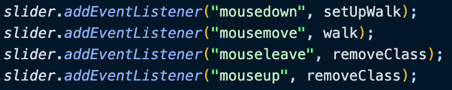
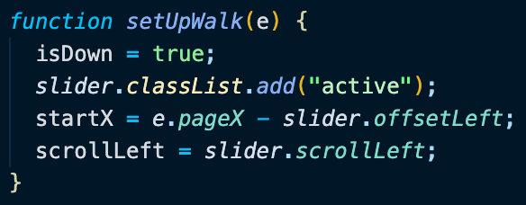
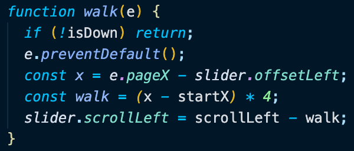
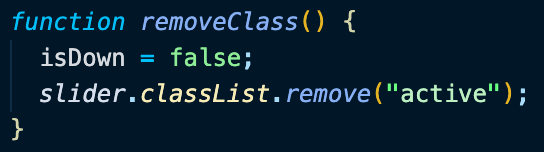

# Day 27 Click & Drag to Scroll

[Walkthru of Code](https://youtu.be/33CnTBIYSAk)

## Task

> - Click on the window & hold and drag across the x - axis

## JavaScript

> - Grab DOM element & define variables
> - 
> - Event listeners
>   - setUpWalk when the mouse is clicked
>   - walk when the mouse is moved
>   - removeClass when the mouse isn't clicked or when it's moved off the event listener
> - 
> - setUpWalk()
>   - add class to DOM element & assign values to variables
> - 
> - walk()
>   - exit function if the mouse isn't clicked
>   - locate where the user clicked relative to the position of the event listener
>   - define length of walk
>   - move the slider by the length of its walk
> - 
> - removeClass removes class from DOM element & makes walk() end
> - 

## Notes

> - .scrollLeft gets or sets the number of pixels that an element's content is scrolled from its left edge

## Source

> Wes Bos JavaScript30: https://javascript30.com/

## Contact

> - [LinkedIn](https://www.linkedin.com/in/benjamin-alt-higginbotham/)
> - [Portfolio](https://higginbotham.fun)
> - [Tweet @BenMichaelJord1](https://twitter.com/BenMichaelJord1)
