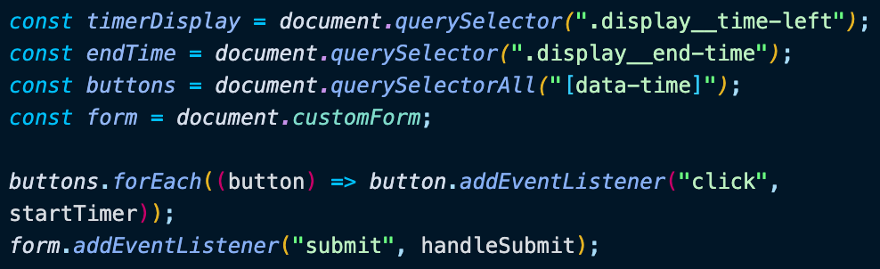

# Day 29 Countdown Timer

[Walkthru of Code](add.url.here)

## Task

> - Display Countdown Clock on the DOM
> - Set Countdown Clock to input from text area or to a preset time from the buttons

## JavaScript

> - Grab DOM & add event listeners
> - 
> - timer()
>   - reset countdown clock
>   - get the current time
>   - add countdown time to the current time
>   - invoke functions to display the countdown time & the end time
>   - count down the seconds
> - 
> - displayTime()
>   - calculate the number of minutes & seconds to display
>   - display the time & add "0" to single digit values
> - 
> - displayEndTime()
>   - get the end time, hours & minutes
>   - display end time & add "0" to single digits
> - 
> - startTimer()
>   - grab time from data-time attribute of button
>   - set the timer to the time
> - 
> - handleSubmit()
>   - prevent default browser behaviour
>   - grab value from input
>   - set the timer to the value
>   - reset the form
>   - 

## Source

> Wes Bos JavaScript30: https://javascript30.com/

## Contact

> - [LinkedIn](https://www.linkedin.com/in/benjamin-alt-higginbotham/)
> - [Portfolio](https://higginbotham.fun/)
> - [Tweet @BenMichaelJord1](https://twitter.com/BenMichaelJord1)
