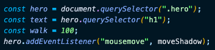
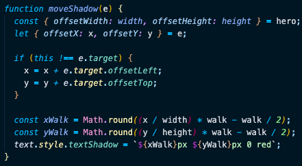

# Day 16 CSS Text Shadow Mouse Move Event

[Walkthru of Code](https://youtu.be/6GtxDqCYy68)

## Task

> - Update the text shadow of an element when the mouse moves

## CSS

> - text-shadow: horizontal-shadow verical-shadow blur color

## JavaScript

> - Grab DOM elements & add event listeners
> - define range of text shadow
> - 
> - moveShadow()
>   - get height & width of event listener
>   - get coordinates of event
>   - if the event trigger is not the event listener
>     - add the coordinates of the event target to the coordinates of the event
>   - get the values of vertical & horizontal shadows
>   - apply those values to the css
>   - 

## Source

> Wes Bos JavaScript30: https://javascript30.com/

## Contact

> - [LinkedIn](https://www.linkedin.com/in/benjamin-alt-higginbotham/)
> - [Portfolio](https://my-portfolio.benjamin-higginbotham.vercel.app/)
> - [Tweet @BenMichaelJord1](https://twitter.com/BenMichaelJord1)
