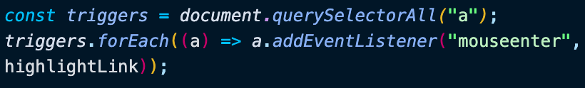
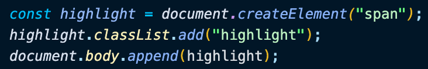
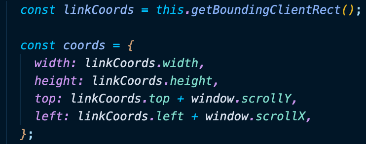
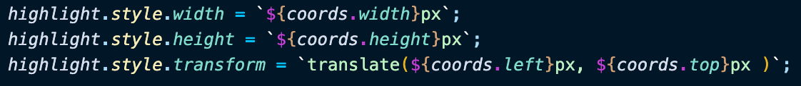

# Day 22 Follow Along Links

[Walkthru of Code](https://youtu.be/th8hq0euQBA)

## Task

> - Use JavaScript to track the coordinates of links
> - Highlight a link using its coordinates when a user hovers over it

## JavaScript

> - Grab DOM elements & add event listeners to them
> - 
> - Create element to highlight links
> - 
> - function()
>   - Get coordinates from event listeners & update to account for scrolling
>   - 
>   - add CSS to highlight element using coordinates
>   - 

## Notes

> - getBoundingClientRect() provides information about the size of an element & its position relative to the viewport

## Source

> Wes Bos JavaScript30: https://javascript30.com/

## Contact

> - [LinkedIn](https://www.linkedin.com/in/benjamin-alt-higginbotham/)
> - [Portfolio](https://my-portfolio.benjamin-higginbotham.vercel.app/)
> - [Tweet @BenMichaelJord1](https://twitter.com/BenMichaelJord1)
