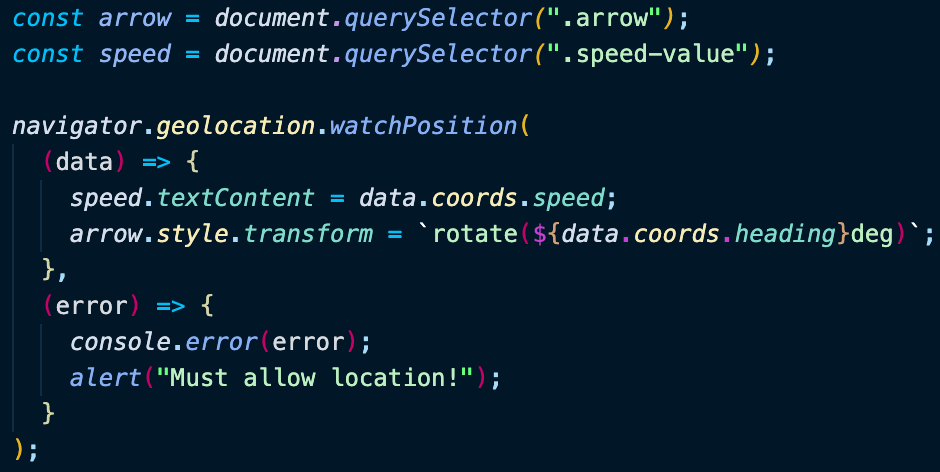

# Day 21 Geolocation

[Walkthru of Code](https://youtu.be/2KEVRdh7j8w)

## Task

> - Use geolocation API to access user's location
> - Move compass & update speed to match data from geolocation

## JavaScript

> - Grab DOM elements
> - Use geolocation & watchPosition method to return data that contains the users location & speed
> - Add speed to DOM
> - Add css transform property to move compass needle
>   

## Notes

> - Navigator.geolocation is a web api that gives Web content access to the location of the device
> - .watchPosition() automatically calls a function each time the position of the device changes

## Source

> Wes Bos JavaScript30: https://javascript30.com/

## Contact

> - [LinkedIn](https://www.linkedin.com/in/benjamin-alt-higginbotham/)
> - [Portfolio](https://my-portfolio.benjamin-higginbotham.vercel.app/)
> - [Tweet @BenMichaelJord1](https://twitter.com/BenMichaelJord1)
