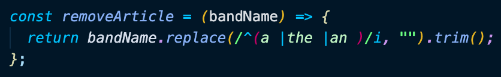
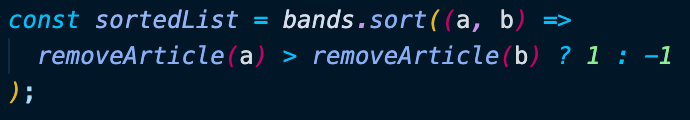
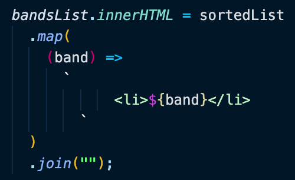

# Day 17 Sort Without the Articles

[Walkthru of Code](https://youtu.be/3lkRnEzBRLQ)

## Task

> Alphabetize a list of band names without articles (a, an, the)

## JavaScript

> - Grab DOM element
> - removeArtcle()
>   - replace any instance of the words a, an, or the with a blank space
>     
> - sort list of bands with sort() after passing each argument thru removeArticle()
> - 
> - add to DOM element \<li> tags with the sorted list of band names
> - 

## Source

> Wes Bos JavaScript30: https://javascript30.com/

## Contact

> - [LinkedIn](https://www.linkedin.com/in/benjamin-alt-higginbotham/)
> - [Portfolio](https://my-portfolio.benjamin-higginbotham.vercel.app/)
> - [Tweet @BenMichaelJord1](https://twitter.com/BenMichaelJord1)
