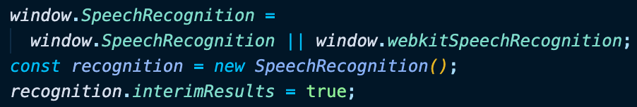
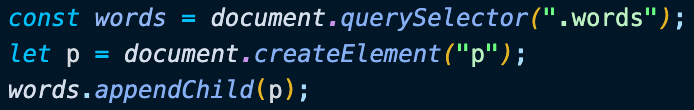
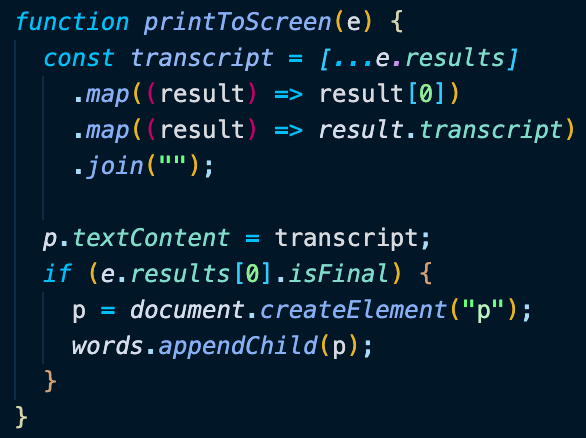
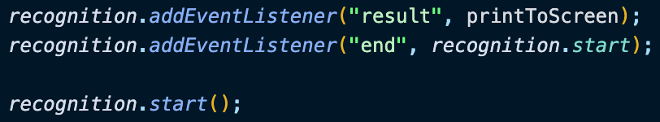

# Day 20 Voice Recognition

[Walkthru of Code](add.url)

## Task

> - Dictate speech from user's microphone
> - Print speech onto DOM

## JavaScript

> - SpeechRecognition
>   - browser support
>   - create a new instance of SpeechRecognition
>   - return interim results
> - 
> - Add DOM element & add new \
 to it
> - 
> - printToScreen()
>   - loop thru nested array to access transcript of user's speech & convert to string
>   - print trascript to \

>   - if user stopped, then started talking again
>     - create new \
 & add it to DOM
> - 
> - Add event listeners so that when a user stops speaking the speech is printed to the DOM & recognition starts again
> - start recognition
> - 

## Notes

> - SpeechRecognition is part of the Web Speech API
> - interimResults determine whether interim results should be returned (true) or not (false)

## Source

> Wes Bos JavaScript30: https://javascript30.com/

## Contact

> - [LinkedIn](https://www.linkedin.com/in/benjamin-alt-higginbotham/)
> - [Portfolio](https://my-portfolio.benjamin-higginbotham.vercel.app/)
> - [Tweet @BenMichaelJord1](https://twitter.com/BenMichaelJord1)
