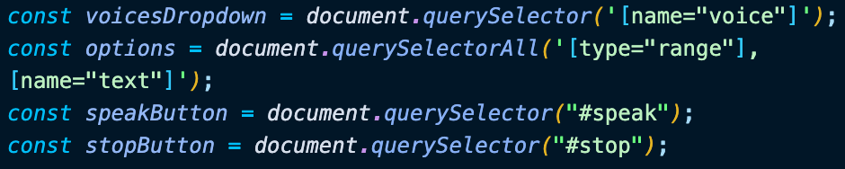
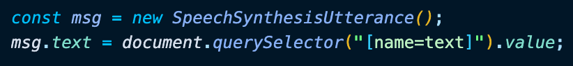
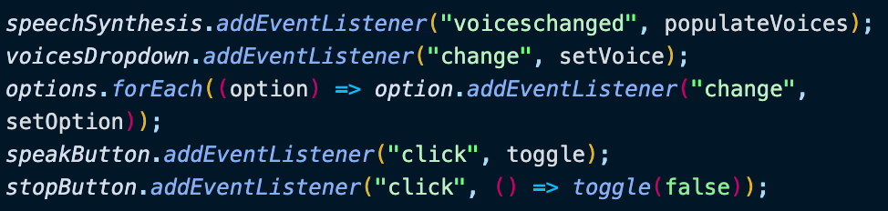
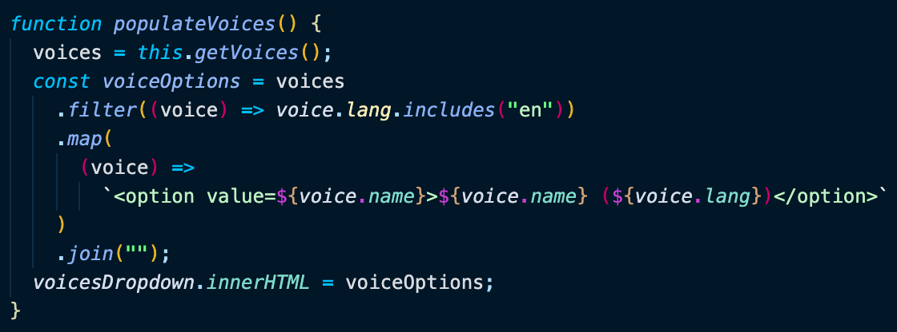
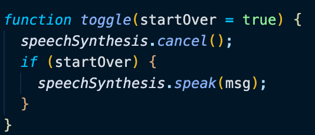
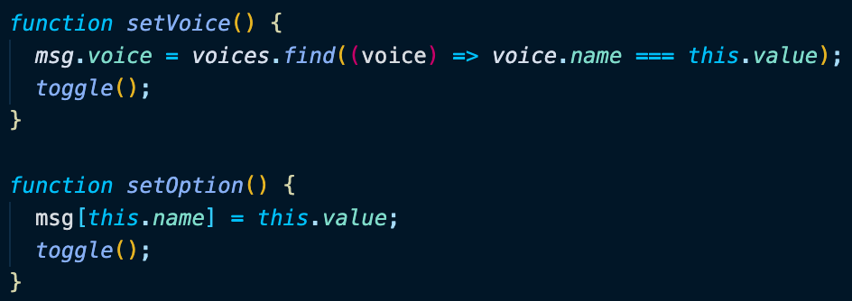

# Day 23 Speech Synthesis

[Walkthru of Code](https://youtu.be/hHEpYhAFJLE)

## Task

> - Get Speech Synthesizer to say a phrase from a text box

## JavaScript

> - Grab DOM elements: drop down menu, inputs, text area, & buttons
> - 
> - Create voices array to hold voice options
> - Create a new instance of SpeechSynthesis & provide it the content from the text area
> - 
> - Add event listeners
>   - populate voices on page load
>   - set the voice when drop down option changes
>   - set input option when value changes
>   - toggle to play when speak button is clicked
>   - toggle to pause when stop button is pressed
> - 
> - populateVoices()
>   - get voices from SpeechSytnthesis API
>   - create list of voice options
>   - add list of voice options to the DOM
> - 
> - toggle()
>   - stop playing speech
>   - play speech if startOver is true
> - 
> - setVoice() to match value from \<option> in drop down menu
> - setOption() to match value of input & text area
> - 

## Notes

> - \<select> creates a drop down menu w/ \<option> children
> - SpeechSynthesisUtterance() contains the content the speech service should read and information about how to read it
> - speechSynthesis can be used to retrieve information about the synthesis voices available on the device, start and pause speech, and other commands besides

## Source

> Wes Bos JavaScript30: https://javascript30.com/

## Contact

> - [LinkedIn](https://www.linkedin.com/in/benjamin-alt-higginbotham/)
> - [Portfolio](https://higginbotham.fun)
> - [Tweet @BenMichaelJord1](https://twitter.com/BenMichaelJord1)
