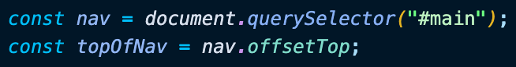
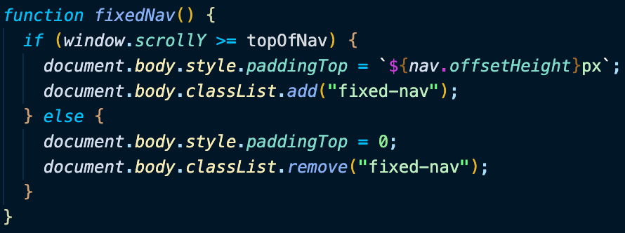

# Day 24 Sticky Nav

[Walkthru of Code](add.url.here)

## Task

> - Keep Nav Bar on top of the page when the user scrolls down

## JavaScript

> - Grab Nav bar from the DOM & calculate its position on the page
> - 
> - Add event listener to the window when the user scrolls
> - fixedNav()
>   - if the user has scrolled past the top of the nav bar
>     - add padding to the body to offset space
>     - add class of "fixed-nav" to the body
>   - otherwise
>     - remove the padding from the body
>     - remove class of "fixed-nav" from the body
> - 

## Notes

> - offsetTop is the number of pixels from the top of the closest relatively positioned parent element

## Source

> Wes Bos JavaScript30: https://javascript30.com/

## Contact

> - [LinkedIn](https://www.linkedin.com/in/benjamin-alt-higginbotham/)
> - [Portfolio](https://higginbotham.fun)
> - [Tweet @BenMichaelJord1](https://twitter.com/BenMichaelJord1)
