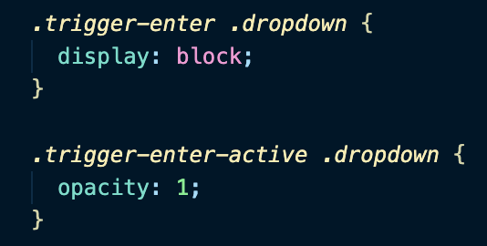
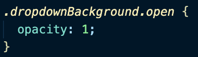
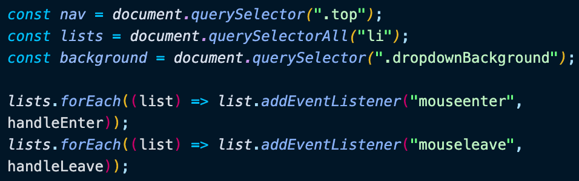
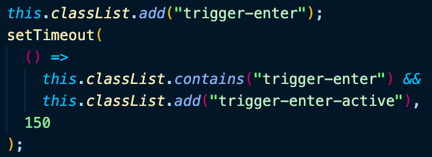
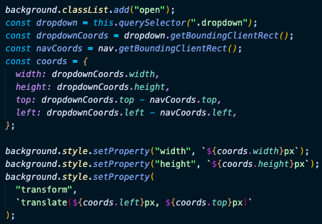

# Day 26 Strip Follow Along Dropdown

[Walkthru of Code](https://youtu.be/1SZ2opkquJc)

## Task

> - Use JavaScript & CSS to programmatically update the background of a dropdown menu

## CSS

> - Trigger-enter & trigger-enter-active: displays content of the list item
> - 
> - Open displays the \
 which will act as the background to the dropdown menu
> - 

## JavaScript

> - Grab DOM elements & add event listeners to them
> - 
> - handleEnter()
>   - add css class to event listener w/ setTimeout to give css transition time to animate effect
>   - 
>   - grab the dom element to add a background to & get its coordinates
>   - create coordinates object to account for location of the nav bar & use them for css property values
>   - set css for background
> - 
> - handleLeave(): remove css classes to hide \<li> content & background

## Source

> Wes Bos JavaScript30: https://javascript30.com/

## Contact

> - [LinkedIn](https://www.linkedin.com/in/benjamin-alt-higginbotham/)
> - [Portfolio](https://higginbotham.fun/)
> - [Tweet @BenMichaelJord1](https://twitter.com/BenMichaelJord1)
