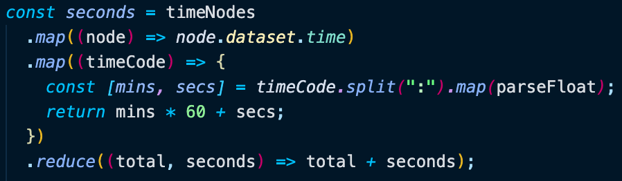

# Day 18 Tally the Time of Multiple Videos

[Walkthru of Code](https://youtu.be/bGI7M_nUq3g)

## Task

> Use array methods .map() & .reduce() to add up the total time of a list of videos

## JavaScript

> - Grab all DOM elements
>   - all tags w/ data-time attribute & spread them into an array
>   - \<li> tag to add total time to
> - 
> - Calculate the number of seconds
>   - create a list of times
>   - create a list of times converted to seconds
>   - add up list of seconds
>   - 
> - Use total number of seconds to calculate the total number of hours & minutes
> - 
> - Add HTML to DOM
>   - the inner HTML & time of each\ \<li> tag
>   - the total time of all the videos
>   - 

## Source

> Wes Bos JavaScript30: https://javascript30.com/

## Contact

> - [LinkedIn](https://www.linkedin.com/in/benjamin-alt-higginbotham/)
> - [Portfolio](https://my-portfolio.benjamin-higginbotham.vercel.app/)
> - [Tweet @BenMichaelJord1](https://twitter.com/BenMichaelJord1)
