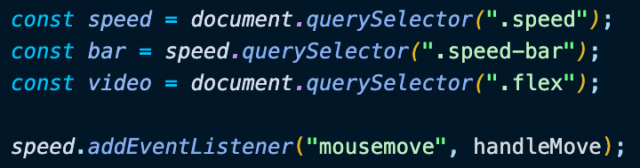
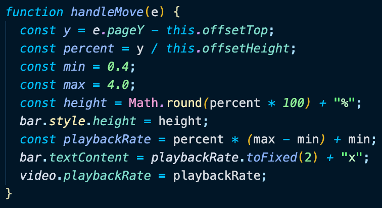

# Day 28 Video Speed Controller

[Walkthru of Code](https://youtu.be/SeD62byoHNc)

## Task

> - Adjust the playback rate of a video

## JavaScript

> - Grab DOM elements & add event listener
> - 
> - handleMove()
>   - locate the position of the mouse
>   - convert position of the mouse to a percentage
>   - define range for playback rate
>   - set height of bar to percentage
>   - calulate playback rate
>   - display playback rate on bar
>   - set playback rate of video
> - 

## Source

> Wes Bos JavaScript30: https://javascript30.com/

## Contact

> - [LinkedIn](https://www.linkedin.com/in/benjamin-alt-higginbotham/)
> - [Portfolio](https://higginbotham.fun/)
> - [Tweet @BenMichaelJord1](https://twitter.com/BenMichaelJord1)
