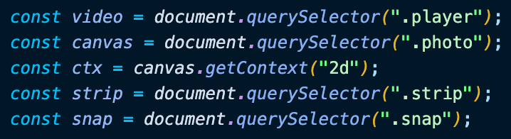
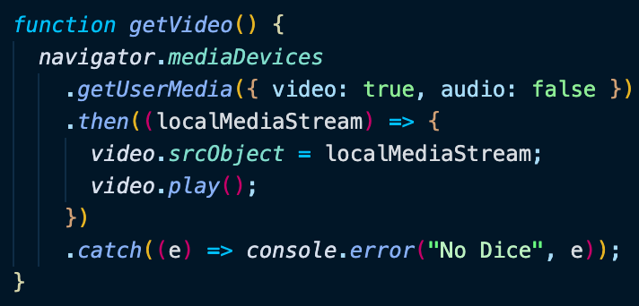
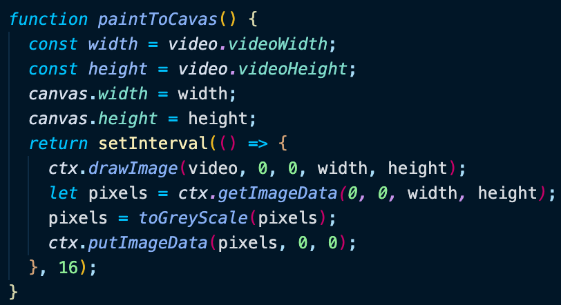
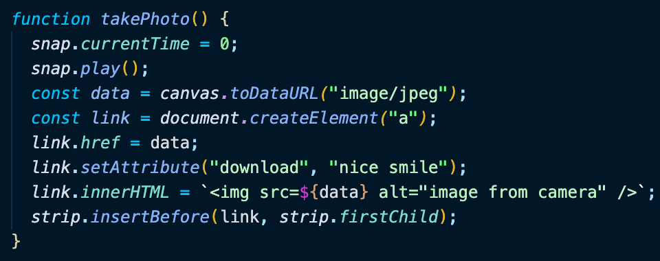
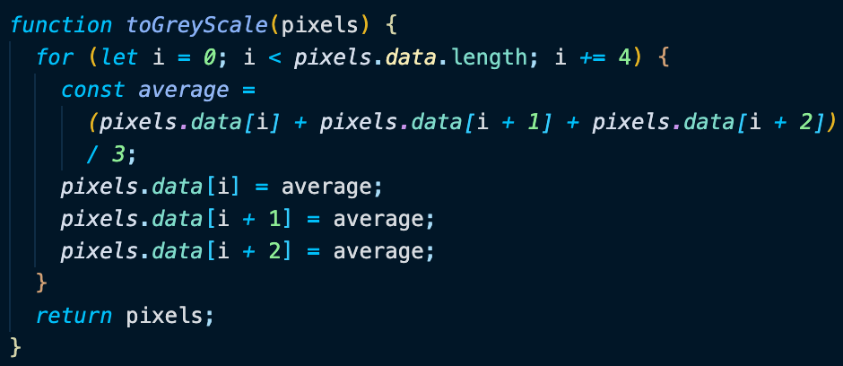
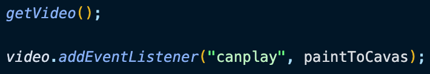

# Day 19 Webcam Fun

[Walkthru of Code](https://youtu.be/DC2BSgILeGs)

## Task

> - Take picture from user's webcam
> - Greyscale picture

## JavaScript

> - Grab DOM elements & create context for canvas
>   
> - getVideo()
>   - get input from webcam
>   - set video content to input from webcam
>   - play the video
> - 
> - paintToCanvas()
>   - save height & width of video to variables
>   - set height & width of canvas to match those of video
>   - draw image onto canvas
>   - access pixels from image
>   - send pixels to function that will alter them
>   - provide the image w/ the altered pixels
> - 
> - takePhoto()
>   - play audio file
>   - create URL from image (i.e base 64)
>   - create \<a> tag
>   - set href to url from image
>   - add download attribute to \<a>
>   - add image to \<a>
>   - prepend \<a> to parent element
> - 
> - toGreyScale()
>   - loop over every 4 elements in array of pixels
>     - every 4 element in array represent rgba values
>   - average rgb values
>   - set the rgb values to the average
> - 
> - invoke getVideo() on page load
> - invoke paintToCanvas() when video is playing
> - 

## Source

> Wes Bos JavaScript30: https://javascript30.com/

## Contact

> - [LinkedIn](https://www.linkedin.com/in/benjamin-alt-higginbotham/)
> - [Portfolio](https://my-portfolio.benjamin-higginbotham.vercel.app/)
> - [Tweet @BenMichaelJord1](https://twitter.com/BenMichaelJord1)
