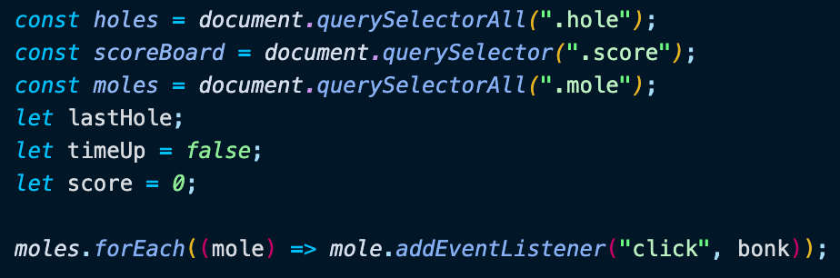
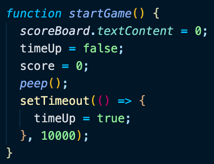
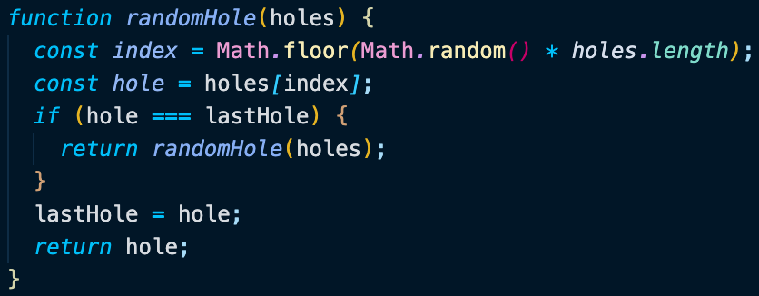
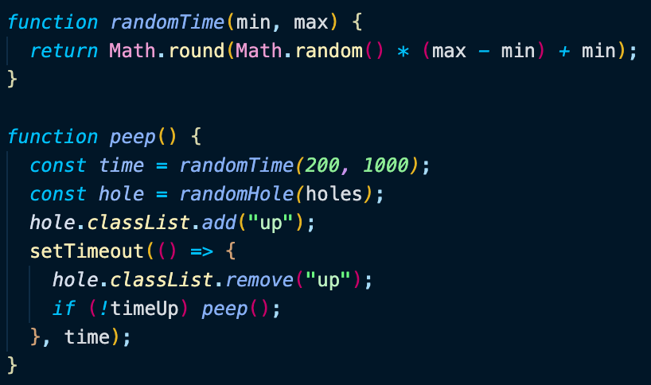
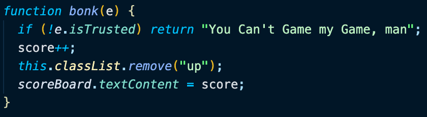

# Day 30 Whack-a-Mole

[Walkthru of Code](add.url.here)

## Task

> - Create Whack-a-Mole game

## JavaScript

> - Grab DOM elements, add event listener & declare game variables
> - 
> - Create timer & reset variables to start a new game
> - 
> - randomHole()
>   - randomly select hole
>   - invoke function again if the same hole is selected twice
>   - define lastHole to randomly selected hole
> - 
> - peep()
>   - randomly select hole & set random time
>   - add class 'up' to selected hole
>   - remove the class 'up' after random time has elapsed
>   - run function again if there is still time left on the clock
> - 
> - bonk()
>   - verify click came from mouse
>   - increase the score
>   - remove the class 'up'
>   - display the score
> - 

## Source

> Wes Bos JavaScript30: https://javascript30.com/

## Contact

> - [LinkedIn](https://www.linkedin.com/in/benjamin-alt-higginbotham/)
> - [Portfolio](https://higginbotham.fun/)
> - [Tweet @BenMichaelJord1](https://twitter.com/BenMichaelJord1)
